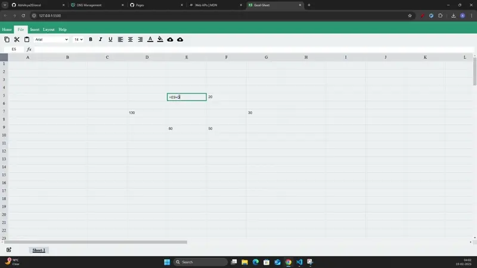

### [Excel](https://excel.abhiarya.in)

This application mimics the functionality of a basic spreadsheet. It allows users to work with formulas, perform text and cell formatting, and supports importing and exporting data in JSON format. The application also includes cycle detection in formulas.

This project was part of my learning journey, where I understood the importance of data structures and algorithms and how they are applied in real-world projects.

<div style="display:flex; flex-wrap:wrap; margin:3rem; justify-content:center;">
<p align="center">

</p>
</div>

##### Features

- Cycle detection to prevent infinite loops in formulas using DFS
- Basic mathematical formulas
- Cell Operation such as selection, cut, copy, paste
- Data Import and Export in JSON format
- multiple spreadsheet
- Basic Text and Cell formatting
  - Font Family
  - Font Size
  - Bold, italic, underline
  - Text Color
  - Alignments (left, center, right)

##### Technologies used

- Graph Algorithms - Cycle detection in a directed graph
- HTML5
- CSS3
- JavaScript
- Browser APIs

##### Setup and Installation

- Clone the repository:

```bash
git clone https://github.com/AbhiArya20/excel.git
```

- Navigate to the project directory:

```bash
cd excel
```

- Open the index.html file in your browser
